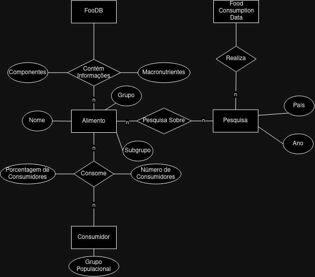

# Modelo para Apresentação do Projeto 1 - Modelo Conceitual e Lógico

## Slides da Apresentação
> Coloque aqui o link para o PDF da apresentação

## Motivação e Contexto

> O propósito desse projeto é analisar e comparar o perfil nutricional médio de diferentes países europeus, ressaltando deficiências e pontos fortes da dieta de cada país.

## Bases de Dados

título da base | link | breve descrição
----- | ----- | -----
`FooDB` | `https://foodb.ca` | `base de dados sobre alimentos, sua química, seus ingredientes e nutrientes.`
`Food Consumption Data` | `https://www.efsa.europa.eu/en/data-report/food-consumption-data` | `dados sobre consumo de alimentos da população europeia.`

## Modelo Conceitual

> Coloque aqui a imagem do modelo conceitual em ER ou UML, como o exemplo a seguir:
> 

## Modelos Lógicos
~~~
ALIMENTO(_Nome_, Grupo, Subgrupo, Macronutrientes, Componentes)

CONSUMIDORES(_Code_, Pais, Ano, Grupo Populacional)

CONSUMO(_NomeAlimento_, _CODE_, Número de Consumidores, Porcentagem de Consumidores)
  NomeAlimento chave estrangeira -> ALIMENTO(Nome)
  CODE chave estrangeira -> CONSUMIDORES(Code)
~~~

## Perguntas de Pesquisa/Análise

#### Pergunta/Análise 1
> * Quais os grupos de alimentos/nutrientes que menos/mais aparecem na dieta de cada país europeu e qual o perfil nutricional desses grupos?
>
>   * Para cada país disponível na base, montaremos seu perfil nutricional integrando os dados fornecidos por ambas as bases. Essa informação pode ser utilizada para avaliar quais os grupos alimentares que mais afetam a cadeia alimentar, auxiliando na avaliação de riscos realizada por agentes de saúde.

#### Pergunta/Análise 2
> * Quais os grupos de alimentos/nutrientes que menos/mais aparecem em cada grupo avaliado?
>   
>   * A base da EFSA apresenta dados divididos por diversos grupos sociais, apresentando divisões por faixa etária, gênero, etc. Associando as duas bases, a dieta de cada um desses grupos pode ser avaliada separadamente.

#### Pergunta/Análise 3
> * Quais alimentos complementam a dieta de cada grupo estudado para balanceá-la?

### Perguntas/Análise Propostas mas Não Implementadas

#### Pergunta/Análise 1
> * Qual o país europeu com perfil nutricional mais completo?
>   
>   * Utilizando as duas bases escolhidas, podemos definir um padrão de perfil nutricional e buscar o país que mais se adequa a esse padrão.

#### Pergunta/Análise 2
> * Qual o grupo social/faixa etária com perfil nutricional mais completo?
>   
>   * Utilizando as duas bases escolhidas, podemos definir um padrão de perfil nutricional e buscar o grupo que mais se adequa a esse padrão.